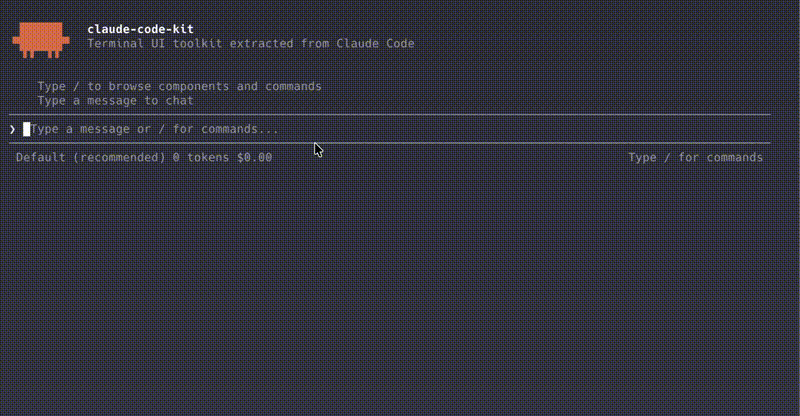

[English](./README.md) | [中文](./README.zh-CN.md)

<div align="center">

# claude-code-kit

**Composable React terminal components and a headless agent framework.**

[](https://www.npmjs.com/package/@claude-code-kit/ui)
[](https://www.npmjs.com/package/@claude-code-kit/ui)
[](./LICENSE)
[](https://www.typescriptlang.org/)
[](https://nodejs.org/)
[](https://react.dev/)



</div>

---

## Why this exists

This toolkit combines composable React terminal components, a React terminal renderer, and a provider-agnostic headless agent.

## Feature highlights

- **10 ready-to-use built-in tools** for file, shell, web, and worktree workflows
- **Advanced tool factories** for MCP-backed integrations, LSP, subagents, tasks, and notebooks
- **MCP client** for dynamic tool discovery from compatible MCP servers (stdio + HTTP)
- **Parallel tool execution** -- read-only tools run concurrently
- **React component model** with Flexbox layout via a pure-TS Yoga engine
- **Provider-agnostic** -- Anthropic, OpenAI, Ollama, DeepSeek, Groq, or any OpenAI-compatible `baseURL`
- **Regression coverage** for rendering, input, providers, tools, permissions, sessions, and compaction

## Current status

- All five npm packages are published as `0.4.0`.
- Release validation on 2026-10-03: `pnpm release:check` passed, including 719 tests across 34 files.
- [Remote CI](https://github.com/Minnzen/claude-code-kit/actions/runs/37066911311) passed on Node 22.12 and 24, including the Node 22.0 packed-runtime job.
- Fresh npm-registry consumer checks passed on Node 22.0.0 and 24.13.0 for ESM/CJS/TSX, a headless mock-agent run, and mounted terminal input/output fixtures, including UI-only installation without Agent.
- Runtime baseline: Node.js 22+, React 19.2.x, and react-reconciler 0.33.x. Both ESM and CommonJS entry points are provided.
- Repository development requires Node.js 22.12+ for build/test tooling. Live provider and real user-terminal acceptance remain separate.
- 3 maintained examples: `hello-world`, `agent-cli`, `alt-screen-dashboard`

See [the API contract](./EXPORTS.md), [roadmap](./docs/roadmap.md), and [migration and release procedure](./RELEASE.md). Version `0.4.0` includes the security fixes, lifecycle contracts, and history APIs described here. The headless sample below uses read-only tools and the Agent's default permission handler.

## API status

### Supported core surface

- `@claude-code-kit/shared`, `@claude-code-kit/ink-renderer`, and the core `@claude-code-kit/ui` component set
- Agent loop, Anthropic/OpenAI/Mock providers, permissions, sessions, and compaction
- `builtinTools`: `Bash`, `Read`, `Edit`, `Write`, `Glob`, `Grep`, `WebFetch`, `WebSearch`, `EnterWorktree`, `ExitWorktree`

### Experimental / evolving

- `MCPClient` and MCP-backed tool discovery
- Higher-level tool factories: `createLspTool`, `createSubagentTool`, `createTaskTool`, `notebookEditTool`
- APIs outside `builtinTools` may still change during `0.x`

## Quick Start

### UI only

```bash
pnpm init --init-type module
pnpm add @claude-code-kit/ui@0.4.0 @claude-code-kit/ink-renderer@0.4.0 react@19.2.4 react-reconciler@0.33.0
pnpm add -D tsx@4.21.0
```

These commands install version `0.4.0`. Save this UI-only example as `app.tsx`, then run `pnpm exec tsx app.tsx`.

```tsx
import { render, Box } from "@claude-code-kit/ink-renderer";
import { REPL, type Message } from "@claude-code-kit/ui";
import React, { useState, useCallback } from "react";

function App() {
  const [messages, setMessages] = useState<Message[]>([]);
  const handleSubmit = useCallback(async (text: string) => {
    setMessages((prev) => [...prev, { id: Date.now().toString(), role: "user", content: text }]);
    const response = `You wrote: ${text}`;
    setMessages((prev) => [
      ...prev,
      { id: (Date.now() + 1).toString(), role: "assistant", content: response },
    ]);
  }, []);

  return (
    <Box padding={1} flexDirection="column" flexGrow={1}>
      <REPL messages={messages} onSubmit={handleSubmit} placeholder="Ask anything..." />
    </Box>
  );
}

await render(<App />);
```

### Agent

```bash
pnpm add @claude-code-kit/agent@0.4.0 @claude-code-kit/tools@0.4.0 @anthropic-ai/sdk@0.82.0
```

```typescript
import { Agent, AnthropicProvider } from "@claude-code-kit/agent";
import { readTool, globTool, grepTool } from "@claude-code-kit/tools";

const agent = new Agent({
  provider: new AnthropicProvider({ apiKey: process.env.ANTHROPIC_API_KEY }),
  model: process.env.ANTHROPIC_MODEL!,
  tools: [readTool, globTool, grepTool],
});

const result = await agent.chat("What files are in src/?");
console.log(result);
```

Set `ANTHROPIC_API_KEY` and `ANTHROPIC_MODEL` to a model available to your account. Providers use optional peer SDKs: install `@anthropic-ai/sdk` for Anthropic or `openai` for OpenAI-compatible APIs. In `0.4.0`, writes require an explicit permission callback or allow list; `autoApproveReadOnly` alone denies them.

Connect to a terminal UI in one line:

```tsx
import { render } from "@claude-code-kit/ink-renderer";
import { AgentREPL } from "@claude-code-kit/ui";

await render(<AgentREPL agent={agent} placeholder="Ask me about your codebase..." />);
```

## Packages

| Package | Description |
|---------|-------------|
| [`@claude-code-kit/shared`](./packages/shared) | Yoga layout engine (pure TS), text measurement, ANSI utilities |
| [`@claude-code-kit/ink-renderer`](./packages/ink-renderer) | Terminal rendering engine -- React reconciler, layout, diffed output |
| [`@claude-code-kit/ui`](./packages/ui) | 30+ components plus commands, keybindings, and optional agent bridge UI |
| [`@claude-code-kit/agent`](./packages/agent) | Headless agent -- providers, permissions, sessions, compaction, experimental MCP |
| [`@claude-code-kit/tools`](./packages/tools) | 10 ready-to-use built-ins plus advanced tool factories |

## Ready-to-use built-ins

| Tool | Type | Description |
|------|------|-------------|
| Bash | write | Shell execution with timeout and opt-in background operation |
| Read | read | File reading with line limits, PDF pages, image base64 |
| Edit | write | String replacement with `replace_all` for global edits |
| Write | write | Create or overwrite files |
| Glob | read | File pattern matching, sorted by modification time |
| Grep | read | Regex search with context, head_limit, multiline, type filter |
| WebFetch | read | HTTP fetch with HTML-to-Markdown, HTTPS upgrade, caching |
| WebSearch | read | DuckDuckGo search with domain allow/block lists |
| EnterWorktree | write | Create and enter a git worktree |
| ExitWorktree | write | Clean up and exit a git worktree |

These are the tools included in `builtinTools` and form the supported default tool surface.

## Advanced tool factories

| Export | Output | Status | Description |
|--------|--------|--------|-------------|
| `createLspTool` | `LSP` tool | Experimental | Language Server Protocol queries against a caller-provided transport |
| `createSubagentTool` | `Agent` tool | Experimental | Delegates isolated work to a child agent with timeout and abort propagation |
| `createTaskTool` | `TaskCreate` / `TaskUpdate` / `TaskGet` / `TaskList` | Experimental | In-memory task orchestration toolset for multi-step work |
| `notebookEditTool` | `NotebookEdit` tool | Experimental | Jupyter notebook cell insert/replace/delete |

## Examples

| Example | Description |
|---------|-------------|
| [`agent-cli`](./examples/agent-cli) | Mini coding assistant with auth, tools, and permission prompts |
| [`hello-world`](./examples/hello-world) | Interactive component showcase (Select, Spinner, Markdown, etc.) |
| [`alt-screen-dashboard`](./examples/alt-screen-dashboard) | System monitoring dashboard in alternate screen buffer |

```bash
pnpm --filter agent-cli-example start
```

## Development

Use Node.js 22.12+ and the pinned pnpm version. Validation includes isolated tarball installation and imports, in addition to source tests.

```bash
pnpm install && pnpm release:check
```


## License

MIT

This is an independent community project. It is not affiliated with or endorsed by Anthropic.
