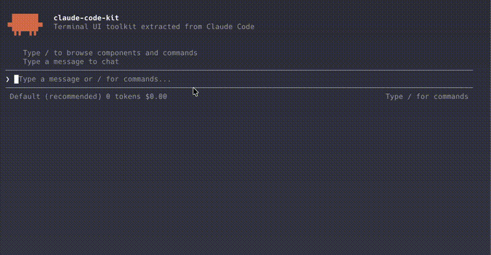

[English](./README.md) | [中文](./README.zh-CN.md)

<div align="center">

# claude-code-kit

[](https://www.npmjs.com/package/@claude-code-kit/ui)
[](https://www.npmjs.com/package/@claude-code-kit/ui)
[](./LICENSE)
[](https://www.typescriptlang.org/)
[](https://nodejs.org/)
[](https://react.dev/)

**终端 UI 工具包 + 无头 Agent 框架，用于构建功能丰富的 CLI 应用程序。**
**灵感来源于 Claude Code 的架构设计。**

[快速开始](#快速开始) -- [包结构](#包结构) -- [组件](#组件) -- [Agent](#agent) -- [示例](#示例)



</div>

---

使用熟悉的组件模型构建交互式 REPL、选择菜单、流式仪表盘和 LLM 驱动的编程助手 — React 组件、通过 Yoga 实现的 Flexbox 布局，以及带可插拔工具执行的无头 Agent 循环。

## 特性

- **React 组件模型** -- 像构建 Web UI 一样构建终端 UI。组件、Hooks、状态、副作用。
- **Flexbox 布局** -- 纯 TypeScript Yoga 布局引擎，无需原生绑定。
- **零闪烁渲染** -- 差量终端输出，只重写发生变化的区域。
- **丰富的组件库** -- REPL、Select、MultiSelect、PromptInput、Spinner、StreamingText、MessageList 等。
- **无头 Agent 框架** -- 基于 AsyncGenerator 的 Agent 循环，多 Provider 支持（Anthropic、OpenAI、Ollama），分级权限模型。
- **内置工具** -- Bash、Read、Edit、Write、Glob、Grep，和 Claude Code 内置工具集一致。
- **UI-Agent 桥接** -- `AgentREPL`、`useAgent`、`AgentProvider` 将 Agent 循环接入终端 UI。
- **命令框架** -- 定义并注册斜杠命令，内置模糊匹配。
- **流式优先** -- 专为实时数据设计：AI 响应、工具输出、日志追踪。
- **跨平台** -- 支持 macOS、Linux 和 Windows 终端，兼容主流 ANSI 标准。

## 包结构

| 包名 | npm 状态 | 描述 |
|------|---------|------|
| `@claude-code-kit/shared` | 已发布 | Yoga 布局引擎（纯 TS 移植版）、文字测量、ANSI 工具 |
| `@claude-code-kit/ink-renderer` | 已发布 | 终端渲染引擎 -- React reconciler、布局、差量输出、输入处理 |
| `@claude-code-kit/ui` | 已发布 | UI 组件库 -- REPL、Select、Spinner、PromptInput、AgentREPL 以及 20+ 个组件 |
| `@claude-code-kit/agent` | 暂未发布 npm | 无头 Agent 框架 -- Agent 类、多 Provider、工具接口、权限模型 |
| `@claude-code-kit/tools` | 暂未发布 npm | 内置工具 -- Bash、Read、Edit、Write、Glob、Grep |

`agent` 和 `tools` 目前可从源码使用，计划在 v0.2.0 发布到 npm。

## 快速开始

### 仅使用 UI（终端组件）

从 npm 安装：

```bash
pnpm add @claude-code-kit/ui react
```

构建一个调用自己后端的 REPL：

```tsx
import { render, Box } from "@claude-code-kit/ink-renderer";
import { REPL, type Message } from "@claude-code-kit/ui";
import { useState, useCallback } from "react";

function App() {
  const [messages, setMessages] = useState<Message[]>([]);
  const [isLoading, setIsLoading] = useState(false);

  const handleSubmit = useCallback(async (text: string) => {
    setMessages((prev) => [...prev, { id: Date.now().toString(), role: "user", content: text }]);
    setIsLoading(true);
    const response = await callYourApi(text);
    setMessages((prev) => [
      ...prev,
      { id: (Date.now() + 1).toString(), role: "assistant", content: response },
    ]);
    setIsLoading(false);
  }, []);

  return (
    <Box padding={1} flexDirection="column" flexGrow={1}>
      <REPL
        messages={messages}
        onSubmit={handleSubmit}
        isLoading={isLoading}
        commands={[
          { name: "clear", description: "清空历史", onExecute: () => setMessages([]) },
        ]}
        placeholder="随便问点什么..."
      />
    </Box>
  );
}

await render(<App />);
```

### Agent（源码使用，npm 发布前）

先克隆并构建：

```bash
git clone https://github.com/Minnzen/claude-code-kit.git
cd claude-code-kit
pnpm install && pnpm build
```

接入无头 Agent 和工具：

```typescript
import { Agent, AnthropicProvider } from "@claude-code-kit/agent";
import { readTool, globTool, grepTool, bashTool } from "@claude-code-kit/tools";

const agent = new Agent({
  provider: new AnthropicProvider({ apiKey: process.env.ANTHROPIC_API_KEY }),
  tools: [readTool, globTool, grepTool, bashTool],
  systemPrompt: "你是一个简洁的编程助手。",
});

const result = await agent.chat("src 目录下有哪些文件？");
console.log(result);
```

用 `AgentREPL` 将 Agent 连接到终端 UI：

```tsx
import { render } from "@claude-code-kit/ink-renderer";
import { AgentREPL } from "@claude-code-kit/ui";
import { Agent, AnthropicProvider, createPermissionHandler } from "@claude-code-kit/agent";
import { readTool, globTool, grepTool, bashTool, editTool, writeTool } from "@claude-code-kit/tools";

const agent = new Agent({
  provider: new AnthropicProvider({ apiKey: process.env.ANTHROPIC_API_KEY }),
  tools: [bashTool, readTool, editTool, writeTool, globTool, grepTool],
  permissionHandler: createPermissionHandler({ autoApproveReadOnly: true }),
});

await render(<AgentREPL agent={agent} placeholder="问我关于代码库的任何问题..." />);
```

## 组件

### 渲染原语 (`@claude-code-kit/ink-renderer`)

| 组件 | 描述 |
|------|------|
| `Box` | 带 padding、margin、边框的 Flexbox 容器 |
| `Text` | 支持颜色、加粗、暗色、下划线、删除线的样式文本 |
| `Spacer` | 填充剩余空间的弹性间距 |
| `ScrollBox` | 带 ref 控制的可滚动内容区域 |
| `Button` | 支持点击处理的可聚焦按钮 |
| `ErrorOverview` | 带堆栈跟踪的格式化错误显示 |

完整列表（Newline、Link、AlternateScreen、RawAnsi 等）见 [docs/components.md](./docs/components.md)。

### UI 组件 (`@claude-code-kit/ui`)

| 组件 | 描述 |
|------|------|
| `REPL` | 完整的读取-求值-打印循环，支持消息历史、流式输出、斜杠命令 |
| `AgentREPL` | 预接入 Agent 的 REPL，处理工具调用、权限确认、流式输出 |
| `Select` | 带键盘导航和描述的单选选择器 |
| `MultiSelect` | 支持切换和确认的多选选择器 |
| `PromptInput` | 带历史记录、多行输入和补全的文本输入框 |
| `MessageList` | 可滚动的消息列表（支持 user/assistant/system 角色） |
| `StreamingText` | 逐字符渐进式文本显示 |
| `Spinner` | 带动词轮播和计时的动画加载指示器 |
| `ProgressBar` | 支持自定义填充和颜色的可视化进度条 |
| `StatusLine` | 带弹性分段的底部状态栏 |
| `Divider` | 带可选标题和颜色的水平分隔线 |
| `Markdown` | 终端 Markdown 渲染（加粗、代码、列表、标题） |
| `WelcomeScreen` | 带提示和副标题的品牌化启动界面 |

### Hooks

| Hook | 描述 |
|------|------|
| `useInput` | 原始键盘输入处理 |
| `useApp` | 应用生命周期（退出、stdin） |
| `useKeybinding` | 声明式按键绑定注册 |
| `useTerminalSize` | 响应式终端尺寸 |
| `useAgent` | 连接 Agent 实例，处理流式输出和工具事件 |
| `useDoublePress` | 双击手势检测 |
| `useInterval` / `useAnimationTimer` | 定时更新 |
| `useTerminalTitle` | 设置终端窗口标题 |

## Agent

`@claude-code-kit/agent` 是一个无头 LLM Agent 框架，不依赖 React 或终端渲染器，可在脚本、服务器中单独运行，或接入任意 UI。

### Provider

| Provider | 后端 | 说明 |
|----------|------|------|
| `AnthropicProvider` | Claude (claude-3-5-sonnet 等) | 需要 `@anthropic-ai/sdk` |
| `OpenAIProvider` | OpenAI、DeepSeek、Groq、SiliconFlow、Ollama | 接受 `baseURL` 以使用本地模型 |
| `MockProvider` | 脚本化响应 | 测试和 demo 用途的一等公民 |

### 内置工具 (`@claude-code-kit/tools`)

| 工具 | 权限级别 | 描述 |
|------|---------|------|
| `readTool` | 自动批准 | 读取文件内容 |
| `globTool` | 自动批准 | 按 glob 模式查找文件 |
| `grepTool` | 自动批准 | 用正则搜索文件内容 |
| `bashTool` | 询问用户 | 执行 shell 命令 |
| `editTool` | 询问用户 | 编辑已有文件 |
| `writeTool` | 询问用户 | 写入新文件 |

### 权限

```typescript
import { createPermissionHandler } from "@claude-code-kit/agent";

// 只读工具自动批准，其余需要确认
const handler = createPermissionHandler({ autoApproveReadOnly: true });

// 始终允许指定工具
const handler = createPermissionHandler({ alwaysAllow: ["glob", "grep", "read"] });
```

## 示例

### `examples/agent-cli`

约 120 行代码实现的迷你编程助手，是工具包的全栈 demo。

- 自动检测 API Key：Anthropic、OpenAI、DeepSeek、Groq、SiliconFlow、Ollama
- 没有 Key 时自动切换到逼真的 mock 演示模式
- 只读工具（glob、grep、read）自动批准，写入工具需要确认
- `AgentREPL` 处理全部 UI，包括流式输出、工具调用展示和权限对话框

```bash
pnpm --filter agent-cli-example start
```

### `examples/hello-world`

交互式组件展示，演示 Select、MultiSelect、Spinner、ProgressBar、Markdown 等 UI 原语，不需要 Agent。

### `examples/alt-screen-dashboard`

终端备用缓冲区内的系统监控仪表盘，含轮询指标和实时图表。

## 来源说明

渲染引擎（`@claude-code-kit/ink-renderer`）提取自 Claude Code 的终端 UI 层并为独立使用做了适配。Yoga 布局引擎（`@claude-code-kit/shared`）是纯 TypeScript 移植版，无需原生绑定。

所有 UI 组件（`@claude-code-kit/ui`）和 Agent 框架（`@claude-code-kit/agent`、`@claude-code-kit/tools`）均为本工具包的原创实现。

这是一个独立的社区项目，与 Anthropic 没有关联，也未获得 Anthropic 的背书。

## 开发

```bash
pnpm install
pnpm build
pnpm typecheck
pnpm test
```

本项目使用 [Turborepo](https://turbo.build) 进行构建，使用 [pnpm workspaces](https://pnpm.io/workspaces) 管理包。

## 许可证

MIT
